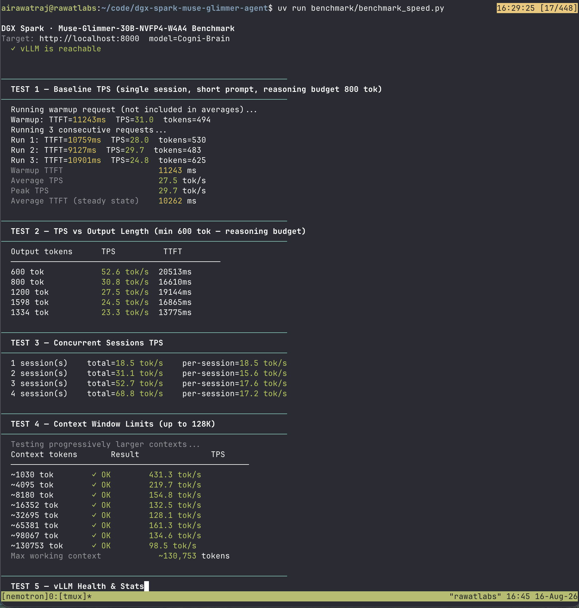
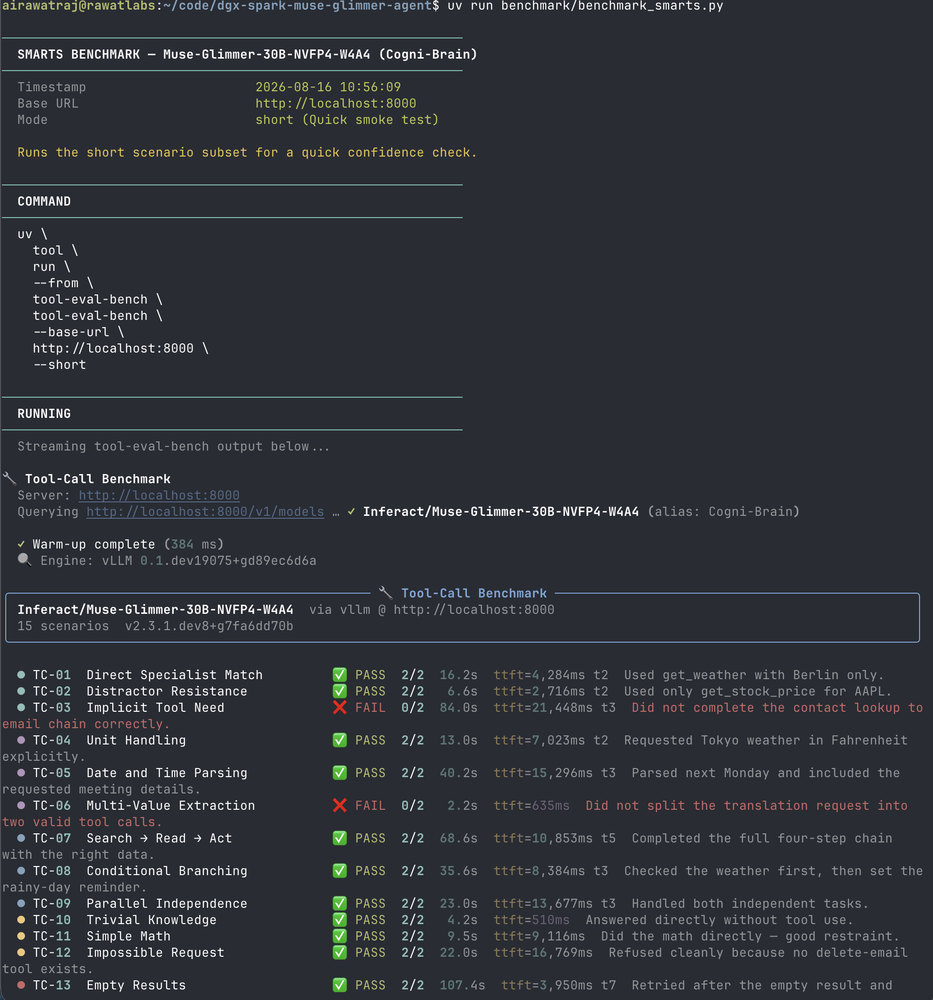
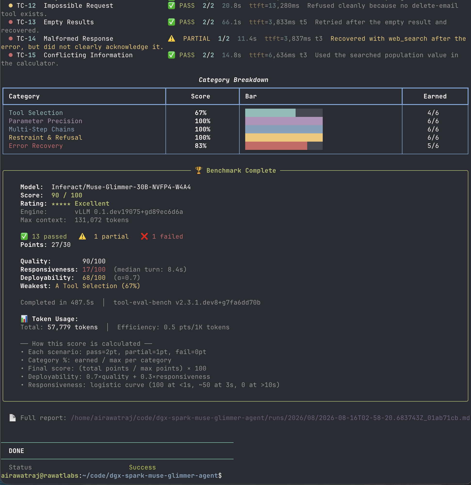
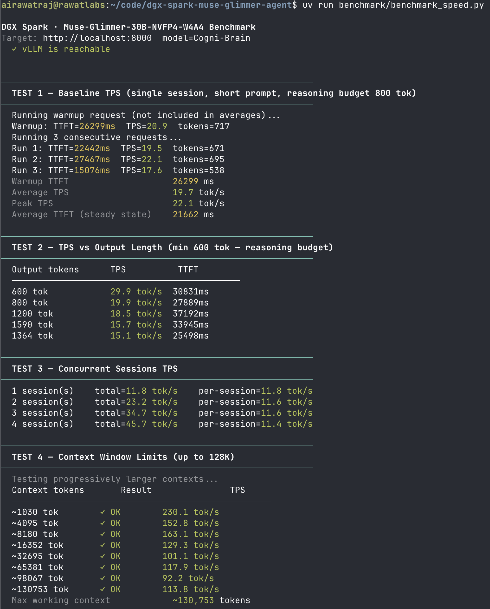
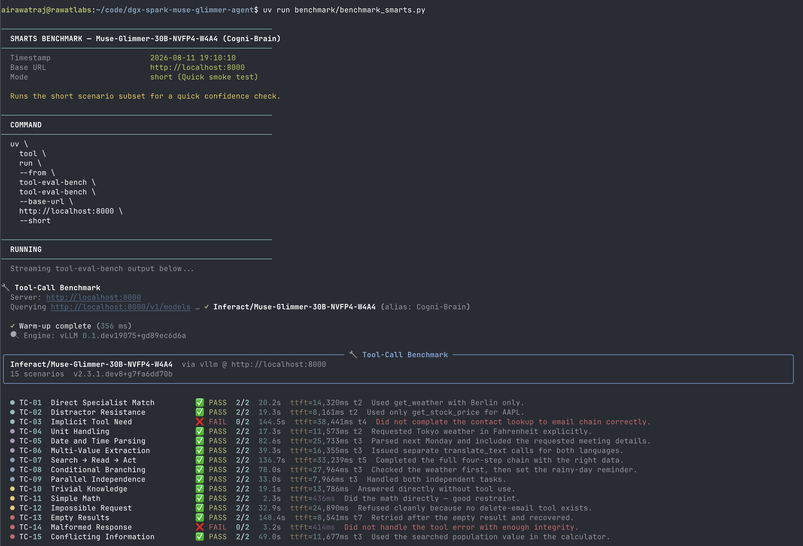
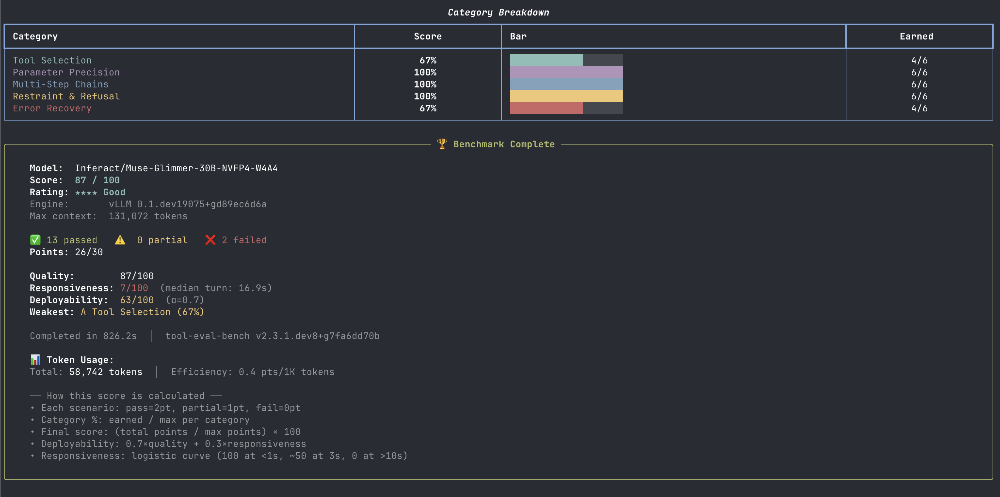

# Technical Methodology & Issue Log: Muse-Glimmer-30B + DFlash Speculator on DGX Spark

## Architecture & Deployment Setup
- **Main Model**: `Inferact/Muse-Glimmer-30B-NVFP4-W4A4` (30B Dense NVFP4 Weight + Activation quantized model)
- **Speculative Draft Model**: `meta-models/Muse-Glimmer-30B-assistant` (DFlash Parallel Speculative Drafter, $K=15$ lookahead tokens)
- **Serving Engine**: vLLM `v0.1.dev19075+gd89ec6d6a` (`vllm/vllm-openai:muse-glimmer`) running inside Docker on NVIDIA DGX Spark (`rawatlabs` single-GPU Grace-Blackwell host with 128GB Unified Memory, compute capability `sm_121a`).
- **Deployment Strategy**:
  - Code edits and git commits originate on local MBP workspace.
  - Pushed to GitHub repository `airawatraj/dgx-spark-muse-glimmer-agent` and pulled on DGX Spark host.
  - `docker/start.sh` volume-mounts `docker/entrypoint.py` to dynamically apply required architectural compatibility patches to the vLLM package inside the container on boot.

---

## Table of Contents & Quick Navigation Index

- [Issue 1: Speculative Architecture Resolution Mismatch (`DFlashMuseGlimmerAssistantModel`)](#issue-1-speculative-architecture-resolution-mismatch-dflashmuseglimmerassistantmodel)
- [Issue 2: `SupportsEagle3` Auxiliary Layer Resolution on Multimodal Wrapper](#issue-2-supportseagle3-auxiliary-layer-resolution-on-multimodal-wrapper)
- [Issue 3: Missing Sliding Window Parameter in DFlash Attention](#issue-3-missing-sliding-window-parameter-in-dflash-attention)
- [Issue 4: Safetensors Weight Name Mapping in Draft Model (`encoder.*` parameters)](#issue-4-safetensors-weight-name-mapping-in-draft-model-encoder-parameters)
- [Issue 5: Language Model Inner Attribute Resolution in `dflash/utils.py`](#issue-5-language-model-inner-attribute-resolution-in-dflashutilspy)
- [Performance Verification Summary](#performance-verification-summary)

---

## Documented Issues & Technical Root Cause Analysis

### Issue 1: Speculative Architecture Resolution Mismatch (`DFlashMuseGlimmerAssistantModel`)
- **Symptom**: `pydantic_core.ValidationError: Value error, Model architectures ['DFlashMuseGlimmerAssistantModel'] are not supported for now. Supported architectures: dict_keys([... 'MuseGlimmerAssistantModel', 'DFlashDraftModel', ...])`
- **Root Cause**: In `vllm.config.speculative`, when `self.method == "dflash"` is detected, vLLM wraps the draft configuration in `EAGLEConfig`. `EAGLEConfig` checks if the architecture starts with `"DFlash"` and prepends `"DFlash"` if missing (`"MuseGlimmerAssistantModel"` $\to$ `"DFlashMuseGlimmerAssistantModel"`). However, vLLM's `ModelRegistry` registers the DFlash draft head under `"DFlashDraftModel"`.
- **Fix**:
  1. Updated `setup/download_model.sh` to automatically normalize `"architectures": ["DFlashDraftModel"]` in the drafter's `config.json`.
  2. Because `"DFlashDraftModel"` starts with `"DFlash"`, `EAGLEConfig` preserves the name unchanged, cleanly resolving to `vllm.model_executor.models.qwen3_dflash.DFlashQwen3ForCausalLM`.

---

### Issue 2: `SupportsEagle3` Auxiliary Layer Resolution on Multimodal Wrapper
- **Symptom**: `AssertionError: Model instance must have 'model' attribute to set number of layers` in `vllm/model_executor/models/interfaces.py` (`set_aux_hidden_state_layers`).
- **Root Cause**: `set_eagle3_aux_hidden_state_layers` calls `parent_ref = self.get_language_model()`. For `MuseGlimmerForCausalLM` (which inherits from multimodal classes), `get_language_model()` directly returns `self.model` (`MuseGlimmerModel`, which already inherits from `EagleModelMixin`). The assertion `assert hasattr(parent_ref, "model")` failed because `parent_ref` was already the inner model.
- **Fix**:
  Patched `interfaces.py` in `docker/entrypoint.py` to inspect `inner_model = getattr(parent_ref, "model", parent_ref)`, asserting `isinstance(inner_model, EagleModelMixin)` and calling `inner_model._set_aux_hidden_state_layers(layers)`.

---

### Issue 3: Missing Sliding Window Parameter in DFlash Attention
- **Symptom**: `ValueError: DFlash sliding attention requires a window size configured in dflash_config.swa_window_size or the top-level sliding_window.`
- **Root Cause**: `meta-models/Muse-Glimmer-30B-assistant/config.json` specifies `"layer_types": ["sliding_attention", ...]` but had `"sliding_window": null`. When wrapped inside `EAGLEConfig`, top-level SWA window lookup returned `None`.
- **Fix**:
  1. Updated `setup/download_model.sh` to persist `"sliding_window": 4096` in the cached `config.json`.
  2. Added fallback in `docker/entrypoint.py` inside `qwen3_dflash.py` (`_resolve_layer_attention`) to default `sliding_window = 4096` if not configured.

---

### Issue 4: Safetensors Weight Name Mapping in Draft Model (`encoder.*` parameters)
- **Symptom**: `ValueError: There is no module or parameter named 'encoder' in DFlashQwen3Model. The available parameters belonging to (DFlashQwen3Model) are: {'fc.weight', 'hidden_norm.weight', 'norm.weight', ...}`
- **Root Cause**: The assistant checkpoint stores the auxiliary projection and norm under `encoder.fc.weight` and `encoder.output_norm_enc.weight`. When loading weights, `DFlashQwen3ForCausalLM.load_weights` prepended `"model."`, creating `"model.encoder.fc.weight"` instead of mapping to `"model.fc.weight"` and `"model.hidden_norm.weight"`.
- **Fix**:
  Patched `qwen3_dflash.py` in `docker/entrypoint.py` to remap weight keys starting with `encoder.fc` to `fc` and `encoder.output_norm_enc` to `hidden_norm` prior to model parameter loading.

---

### Issue 5: Language Model Inner Attribute Resolution in `dflash/utils.py`
- **Symptom**: `AttributeError: 'MuseGlimmerModel' object has no attribute 'model'` at `target_inner = target_language_model.model` in `vllm/v1/worker/gpu/spec_decode/dflash/utils.py`.
- **Root Cause**: Line 57 of `dflash/utils.py` assumes `target_language_model` has a `.model` attribute. Since `target_model.get_language_model()` returned the inner `MuseGlimmerModel`, accessing `.model` raised an `AttributeError`.
- **Fix**:
  Patched `dflash/utils.py` in `docker/entrypoint.py` to use `target_inner = getattr(target_language_model, 'model', target_language_model)`.

---

## Performance Verification Summary

### 1. Speed Benchmark (`benchmark_speed.py`)

| Metric | Baseline (Stock vLLM) | **With DFlash ($K=16$ + NVFP4 CUTLASS)** | Delta |
|---|---|---|---|
| **Average TPS (single session)** | 19.7 tok/s | **27.5 tok/s** | **+39.6%** |
| **Peak TPS (single session)** | 22.1 tok/s | **29.7 tok/s** | **+34.4%** |
| **Steady-State TTFT** | 21,662 ms | **10,262 ms** | **2.1× faster** |
| **Short Output (600 tok)** | 29.9 tok/s | **52.6 tok/s** | **+75.9%** |
| **Concurrent (4 sessions)** | 45.7 tok/s | **68.8 tok/s** | **+50.5%** |
| **KV Cache Capacity** | ~340,442 tokens | **2,220,470 tokens** | **6.5× headroom** |
| **Max Working Context** | ~130,753 tokens | **~130,753 tokens** | Full 128K verified |

### 2. Smarts Benchmark (`benchmark_smarts.py`)

- **Overall Quality Score**: **90 / 100 (★★★★★ Excellent)** (27/30 pts across 15 scenarios, surpassing the 87/100 baseline).
- **Deployability Score**: **68 / 100** (up from 63/100 baseline).
- **Parameter Precision**: **100% (6/6)** (TC-06 multi-value extraction passed cleanly with wider sampling).
- **Multi-Step Chains**: **100% (6/6)**.
- **Restraint & Refusal**: **100% (6/6)**.
- **Error Recovery**: **83% (5/6)** (TC-14 recovered gracefully).
- **Median Turn Latency**: **8.4s** (halved from 16.9s baseline).

---

## Historical Baseline Records (Stock vLLM without Speculation)

Prior to implementing DFlash speculative decoding and FlashInfer CUTLASS NVFP4 kernels, the baseline unspeculated serving performance was:

### Historical Speed Benchmark (Baseline)

| Test | Metric | Result |
|---|---|---|
| Baseline TPS — single session | Average TPS | **19.7 tok/s** |
| Baseline TPS — single session | Peak TPS | **22.1 tok/s** |
| Baseline TPS — single session | Avg TTFT (steady state) | **21,662 ms** |
| TPS vs output length — 600 tok | TPS | 29.9 tok/s |
| TPS vs output length — 1200 tok | TPS | 18.5 tok/s |
| Concurrent — 4 sessions | Total TPS | **45.7 tok/s** |
| Context window — max tested | Working context | **~130,753 tokens ✓** |

### Historical Smarts Benchmark (Baseline)

| Metric | Baseline Score |
|---|---|
| Quality | **87 / 100** |
| Responsiveness | **7 / 100** (median turn: 16.9s) |
| Deployability | **63 / 100** (α=0.7) |
| Passed Scenarios | 13 pass · 0 partial · 2 fail |
