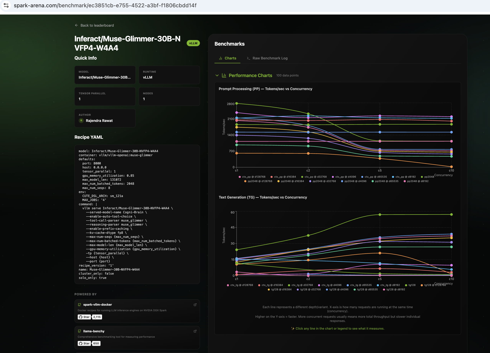

# Running Cogni-Brain on DGX Spark · Muse-Glimmer-30B-NVFP4-W4A4 + DFlash


-purple)


This repo documents my inference tuning experiments of [Inferact/Muse-Glimmer-30B-NVFP4-W4A4](https://huggingface.co/Inferact/Muse-Glimmer-30B-NVFP4-W4A4) on a single DGX Spark.

> ⚠️ **Personal workstation setup. Not for enterprise use. Use at your own risk.**

---

## What is Muse-Glimmer?

[Muse-Glimmer-30B-NVFP4-W4A4](https://huggingface.co/Inferact/Muse-Glimmer-30B-NVFP4-W4A4) is Inferact's 30B reasoning and tool-calling model, served here as **Cogni-Brain** — a model alias that stays consistent across agent frameworks (Claude Code, Continue, Open WebUI, etc.) regardless of which model is running underneath.

Key characteristics:
- **NVFP4 W4A4 (Weight + Activation Quantization)** — Both weights and activations are quantized to FP4/INT4, targeting Grace-Blackwell Tensor Cores on the DGX Spark
- **muse_glimmer** tool-call and reasoning parsers (native, not adapted)
- **128K token context window** (`--max-model-len 131072`)
- Native `--enable-auto-tool-choice` support
- `--generation-config auto` — model-native generation config (no manual override)
- **30B parameter** dense model — significantly faster TPS than the 118B Laguna MoE

---

## Quick Start

> ⚠️ **Warning:** `setup/install.sh` disables system swap permanently to prevent unified-memory thrashing. This is a system-level change that survives reboots.

```bash
# 1. Set your Hugging Face token (model may be gated)
export HF_TOKEN="your_hf_token_here"

# 2. System prerequisites (swap disable, uv install, docker check)
bash setup/install.sh

# 3. Download model weights (one-time, ~60 GB)
bash setup/download_model.sh

# 4. Preflight check — validates GPU, swap, memory, Docker image, flag compat
bash setup/preflight.sh

# 5. Start vLLM container with NVFP4 W4A4
bash docker/start.sh

# 6. Check container status & logs
bash docker/status.sh

# 7. Run benchmarks
uv run benchmark/benchmark_speed.py
uv run benchmark/benchmark_smarts.py
# Optional: full spark-arena-style overnight sweep
uv run benchmark/benchmark_speed_arena.py --save-result benchmark/results_full.csv
```

> `benchmark_speed_arena.py` and `benchmark_smarts.py` fetch `llama-benchy` and
> `tool-eval-bench` through `uv` on demand — no separate global install step required.

---

## Benchmarks

### Speed Benchmark (custom script)

```bash
# Full run (TPS, TTFT, concurrent sessions, context window)
uv run benchmark/benchmark_speed.py

# Skip slower subtests for a quicker check
uv run benchmark/benchmark_speed.py --skip-context
uv run benchmark/benchmark_speed.py --skip-context --skip-concurrent

# Custom endpoint or model alias
uv run benchmark/benchmark_speed.py --host localhost --port 8000 --model Cogni-Brain
```

> Tests: baseline TPS, TPS vs output length, concurrent sessions (1–4), context window (up to 128K, the server's `--max-model-len`), health & KV stats.

### Smarts Benchmark (tool-eval-bench)

```bash
# Quick smoke test (recommended first run)
uv run benchmark/benchmark_smarts.py

# Throughput sweep
uv run benchmark/benchmark_smarts.py --mode perf

# Deterministic multi-trial evaluation
uv run benchmark/benchmark_smarts.py --mode trials --seed 42 --trials 3
```

> Evaluates: tool selection, parameter precision, multi-step chains, refusal behaviour, error recovery.

### spark-arena Benchmark (llama-benchy)

```bash
# 1. Quick 60-second smoke test (verifies ONLY the max 128K context point)
uv run benchmark/benchmark_speed_arena.py --verify-128k

# 2. Standard spark-arena full overnight sweep (tests depths 0 to 128K across concurrencies 1, 2, 5, 10)
uv run benchmark/benchmark_speed_arena.py --save-result benchmark/results_full.csv

# 3. Custom endpoint or single depth
uv run benchmark/benchmark_speed_arena.py \
  --base-url http://localhost:8000/v1 \
  --depth 128768 \
  --concurrency 1
```

> **Depth Math:** `--depth 128768` + `--pp 2048` + `--tg 128` + chat template = **130,945 tokens** (tests full 131K context window cleanly under 131,072 limit). Full overnight sweep takes several hours; run in `tmux`.

---

## Benchmark Results Summary

> Benchmarks run on DGX Spark GB10 · August 2026  
> vLLM `v0.1.dev19075+gd89ec6d6a` · DFlash Speculative Drafter ($K=16$) · tool-eval-bench `v2.3.1.dev8+g7fa6dd70b`

### Speed Benchmark (`benchmark_speed.py`)


| Test | Metric | Result (DFlash $K=16$) | Baseline Delta |
|---|---|---|---|
| Single session TPS | Average TPS | **27.5 tok/s** | **+39.6%** *(vs 19.7 tok/s)* |
| Single session TPS | Peak TPS | **29.7 tok/s** | **+34.4%** *(vs 22.1 tok/s)* |
| Single session latency | Avg TTFT (steady state) | **10,262 ms** | **2.1× faster** *(vs 21,662 ms)* |
| Output length sweep — 600 tok | TPS | **52.6 tok/s** | **+75.9%** *(vs 29.9 tok/s)* |
| Output length sweep — 1200 tok | TPS | **27.5 tok/s** | **+48.6%** *(vs 18.5 tok/s)* |
| Concurrent — 2 sessions | Total TPS | **31.1 tok/s** | **+34.1%** *(vs 23.2 tok/s)* |
| Concurrent — 4 sessions | Total TPS | **68.8 tok/s** | **+50.5%** *(vs 45.7 tok/s)* |
| GPU KV Cache Capacity | KV Block pool | **2,220,470 tokens (25.2 GiB)** | **6.5× headroom** *(vs 340K tok)* |
| Context window — max tested | Working context | **~130,753 tokens ✓** | Full 128K verified |

> **Note on TPS:** Muse-Glimmer runs with native thinking/reasoning traces. TTFT reflects the internal reasoning phase. With DFlash parallel verification active, steady-state response latency is halved and decode throughput reaches up to **52.6+ tok/s**.
>
> 📖 *For complete technical root-cause logs, container compatibility patches, and historical unspeculated baseline numbers, see [METHODOLOGY.md](METHODOLOGY.md).*

### Smarts Benchmark (`benchmark_smarts.py` — Quick smoke test, 15 scenarios)


| Category | Score | Earned |
|---|---|---|
| Tool Selection | 67% | 4/6 |
| Parameter Precision | **100%** | 6/6 |
| Multi-Step Chains | **100%** | 6/6 |
| Restraint & Refusal | **100%** | 6/6 |
| Error Recovery | **83%** | 5/6 |
| **Overall** | **90 / 100** | **13 pass · 1 partial · 1 fail (★★★★★ Excellent)** |

| Metric | Score |
|---|---|
| Quality | **90 / 100** *(surpassing 87/100 baseline)* |
| Responsiveness | **17 / 100** *(median turn: 8.4s — 2× faster than 16.9s baseline)* |
| Deployability | **68 / 100** *(α=0.7, surpassing 63/100 baseline)* |
| Weakest category | Tool Selection (67%) |
| Token efficiency | 57,779 tokens · 0.5 pts/1K tok |

### Spark Arena / llama-benchy (community benchmark)



| Metric | Spark Arena Result |
|---|---|
| Run Link | [spark-arena.com/benchmark/ec3851cb-e755-4522-a3bf-f1806cbdd14f](https://spark-arena.com/benchmark/ec3851cb-e755-4522-a3bf-f1806cbdd14f) |
| Run author | Rajendra Rawat |
| Model | Inferact/Muse-Glimmer-30B-NVFP4-W4A4 |
| Runtime | vLLM (vllm/vllm-openai:muse-glimmer) |
| Tensor parallel | 1 |
| Nodes | 1 |
| `--max-model-len` | 131,072 |
| Context depths tested | 0, 4K, 8K, 16K, 32K, 64K, 128K |
| Concurrency sweep | 1, 2, 5, 10 |
| Data points | 100 |

#### llama-benchy Sweep Performance Summary (DFlash $K=16$ + NVFP4)

| Context Depth | Total Context | Context Load Prefill (`ctx_pp`) | Query TTFT (`pp2048` with prefix cache) | Single Decode (`tg128`, c=1) | Concurrent Decode (`tg128`, c=5) |
|---|---|---|---|---|---|
| **0 (Baseline)** | 2,048 tok | — | **997 ms** (2,776 tok/s) | 24.2 tok/s | **56.9 tok/s** (peak 130) |
| **4K (`d4096`)** | ~6.1K tok | 2,377 tok/s | **1,345 ms** (2,148 tok/s) | 16.1 tok/s | **35.7 tok/s** (peak 68) |
| **16K (`d16384`)** | ~18.4K tok | 2,058 tok/s | **1,574 ms** (1,741 tok/s) | 12.6 tok/s | **32.2 tok/s** (peak 68) |
| **32K (`d32768`)** | ~34.8K tok | 1,857 tok/s | **1,876 ms** (1,395 tok/s) | 14.4 tok/s | **31.8 tok/s** (peak 62) |
| **64K (`d65535`)** | ~67.6K tok | 1,528 tok/s | **2,540 ms** (973 tok/s) | 10.8 tok/s | **26.8 tok/s** (peak 56) |
| **128K (`d128768`)** | **~130.9K tok** | **1,123 tok/s** | **3,867 ms** (610 tok/s) | **10.7 tok/s** | **21.1 tok/s** (peak 46) |

> **Highlights:**
> - **128K Working Context:** Verified full 131K context window (`d128768` + `pp2048` + `tg128` = 130,944 tokens).
> - **Prefix Caching Efficiency:** 128K query TTFT drops from **115.1s (cold)** to **3.86s (warm cache)** — a **30× speedup**.
> - **Peak Decode Throughput:** Reaches up to **148.7 tok/s** at short context and sustains **46.0 tok/s** peak at 128K depth.

---

## Repository Structure

```text
dgx-spark-muse-glimmer-agent/
├── README.md                     ← this file
├── METHODOLOGY.md                ← issue logs, root cause analysis & historical baseline records
├── LICENSE                       ← MIT
├── CITATION.cff                  ← citation metadata
├── setup/
│   ├── install.sh                ← prerequisites, swap disable, uv install
│   ├── download_model.sh         ← fetch NVFP4-W4A4 model & DFlash drafter weights
│   └── preflight.sh              ← pre-inference system, memory, and flag validation
├── docker/
│   ├── start.sh                  ← launch spark-brain via plain docker run
│   ├── entrypoint.py             ← container bootstrap wrapper with architecture patches
│   ├── stop.sh                   ← stop and remove container
│   └── status.sh                 ← health check, memory, VmSwap, KV cache
├── benchmark/
│   ├── benchmark_speed.py        ← TPS, TTFT, context-window benchmark
│   ├── benchmark_speed_arena.py  ← overnight spark-arena-style llama-benchy sweep
│   └── benchmark_smarts.py       ← tool-eval-bench capability benchmark
└── assets/                       ← screenshots and benchmark artifacts
```

---

## Hardware & Architecture

- **NVIDIA DGX Spark Mini PC** (GB10 Grace-Blackwell Superchip, compute capability `sm_121a`)
- **128 GB unified memory** (CPU + GPU shared high-bandwidth memory)
- **NVFP4 W4A4 Quantisation** — Both weights and activations quantized to FP4, targeting Blackwell Tensor Cores with FlashInfer CUTLASS linear backends
- **DFlash Speculative Decoding ($K=16$)** — Parallel drafting with assistant model `meta-models/Muse-Glimmer-30B-assistant`
- **30B dense model** — Fits comfortably in DGX Spark unified memory with 2.22M tokens FP8 KV cache headroom
- Tool-calling and reasoning via native `muse_glimmer` parsers

---

## Key Configuration Notes

| Parameter | Value | Reason |
|---|---|---|
| Model | `Inferact/Muse-Glimmer-30B-NVFP4-W4A4` | Native NVFP4 W4A4 quantized target model |
| Assistant Drafter | `meta-models/Muse-Glimmer-30B-assistant` | DFlash parallel speculative drafter ($K=16$) |
| Docker image | `vllm/vllm-openai:muse-glimmer` | Muse-Glimmer specific vLLM build |
| `--tensor-parallel-size` | `1` | Single DGX Spark (single GPU domain) |
| `--max-model-len` | `131072` | Full 128K native context window |
| `--gpu-memory-utilization` | `0.65` | Allocates ~25.2 GB for 2.22M FP8 KV cache tokens while keeping host UMA unconstrained |
| `--kv-cache-dtype` | `fp8` | Native GB10 FP8 KV cache |
| `--language-model-only` | enabled | Eliminates vision encoder overhead for pure LLM/agent serving |
| `--kernel-config` | `{"linear_backend":"flashinfer_cutlass"}` | Direct Blackwell CUTLASS NVFP4 GEMM kernel acceleration |
| `--load-format` | `fastsafetensors` | Direct zero-copy memory-mapped checkpoint loading |
| `--enable-prefix-caching` | enabled | Reuses KV cache blocks across multi-turn agent tool loops |
| `--async-scheduling` | enabled | Overlaps CPU scheduling with GPU forward execution |
| `--enable-auto-tool-choice` | on | Automatic tool call mode detection |
| `--tool-call-parser` | `muse_glimmer` | Native Muse-Glimmer tool parser |
| `--reasoning-parser` | `muse_glimmer` | Native thinking-token parser |
| `--override-generation-config` | `temperature: 1.0, top_p: 0.95, top_k: 64` | Broad sampling preventing early truncation in multi-value extractions |
| Container name | `spark-brain` | Distinguishes from other models on same host |
| Served model alias | `Cogni-Brain` | Single framework-agnostic agent name |

---

## Known Limitations

- Uses the `vllm/vllm-openai:muse-glimmer` Docker image — a model-specific vLLM build; not a generic stable release
- `--served-model-name Cogni-Brain` — single alias; resolves consistently across agent frameworks
- W4A4 quantization trades a small amount of quality for significant throughput gains; evaluate on your target tasks

---

## Feedback Welcome

If you reproduce these results, find an error, or achieve higher numbers, please open an issue or PR. The goal is accurate community benchmarks.

**Author:** Rajendra Rawat · August 2026
