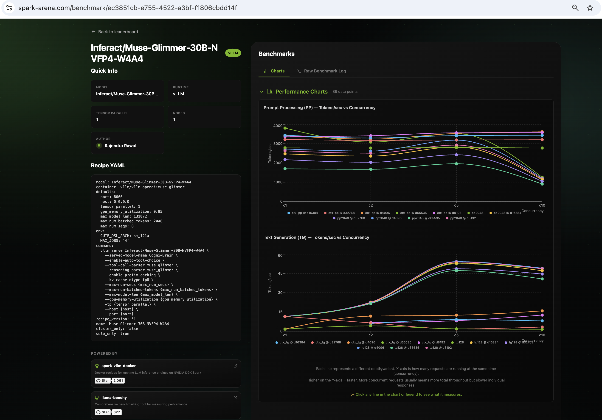

# Running Cogni-Brain on DGX Spark · Muse-Glimmer-30B-NVFP4-W4A4


This repo documents my inference tuning experiments of [Inferact/Muse-Glimmer-30B-NVFP4-W4A4](https://huggingface.co/Inferact/Muse-Glimmer-30B-NVFP4-W4A4) on a single DGX Spark.

> ⚠️ **Personal workstation setup. Not for enterprise use. Use at your own risk.**

---

## What is Muse-Glimmer?

[Muse-Glimmer-30B-NVFP4-W4A4](https://huggingface.co/Inferact/Muse-Glimmer-30B-NVFP4-W4A4) is Inferact's 30B reasoning and tool-calling model, served here as **Cogni-Brain** — a model alias that stays consistent across agent frameworks (Claude Code, Continue, Open WebUI, etc.) regardless of which model is running underneath.

Key characteristics:
- **NVFP4 W4A4 (Weight + Activation Quantization)** — Both weights and activations are quantized to FP4/INT4, targeting Grace-Blackwell Tensor Cores on the DGX Spark
- **muse_glimmer** tool-call and reasoning parsers (native, not adapted)
- **128K token context window** (`--max-model-len 131072`)
- Native `--enable-auto-tool-choice` support
- `--generation-config auto` — model-native generation config (no manual override)
- **30B parameter** dense model — significantly faster TPS than the 118B Laguna MoE

---

## Quick Start

> ⚠️ **Warning:** `setup/install.sh` disables system swap permanently to prevent unified-memory thrashing. This is a system-level change that survives reboots.

```bash
# 1. Set your Hugging Face token (model may be gated)
export HF_TOKEN="your_hf_token_here"

# 2. System prerequisites (swap disable, uv install, docker check)
bash setup/install.sh

# 3. Download model weights (one-time, ~60 GB)
bash setup/download_model.sh

# 4. Preflight check — validates GPU, swap, memory, Docker image, flag compat
bash setup/preflight.sh

# 5. Start vLLM container with NVFP4 W4A4
bash docker/start.sh

# 6. Check container status & logs
bash docker/status.sh

# 7. Run benchmarks
uv run benchmark/benchmark_speed.py
uv run benchmark/benchmark_smarts.py
# Optional: full spark-arena-style overnight sweep
uv run benchmark/benchmark_speed_arena.py --save-result benchmark/results_full.csv
```

> `benchmark_speed_arena.py` and `benchmark_smarts.py` fetch `llama-benchy` and
> `tool-eval-bench` through `uv` on demand — no separate global install step required.

---

## Benchmarks

### Speed Benchmark (custom script)

```bash
# Full run (TPS, TTFT, concurrent sessions, context window)
uv run benchmark/benchmark_speed.py

# Skip slower subtests for a quicker check
uv run benchmark/benchmark_speed.py --skip-context
uv run benchmark/benchmark_speed.py --skip-context --skip-concurrent

# Custom endpoint or model alias
uv run benchmark/benchmark_speed.py --host localhost --port 8000 --model Cogni-Brain
```

> Tests: baseline TPS, TPS vs output length, concurrent sessions (1–4), context window (up to 128K, the server's `--max-model-len`), health & KV stats.

### Smarts Benchmark (tool-eval-bench)

```bash
# Quick smoke test (recommended first run)
uv run benchmark/benchmark_smarts.py

# Throughput sweep
uv run benchmark/benchmark_smarts.py --mode perf

# Deterministic multi-trial evaluation
uv run benchmark/benchmark_smarts.py --mode trials --seed 42 --trials 3
```

> Evaluates: tool selection, parameter precision, multi-step chains, refusal behaviour, error recovery.

### spark-arena Benchmark (overnight, llama-benchy)

```bash
# Standard spark-arena sweep (tests context depths up to 128K)
uv run benchmark/benchmark_speed_arena.py --save-result benchmark/results_full.csv

# Custom endpoint
uv run benchmark/benchmark_speed_arena.py \
  --base-url http://localhost:8000/v1 \
  --model Inferact/Muse-Glimmer-30B-NVFP4-W4A4 \
  --served-model-name Cogni-Brain \
  --save-result benchmark/results_full.csv
```

> This sweep tests concurrency 1, 2, 5, 10 at depth points from 0 to 131,072 tokens.
> Plan for several hours; run overnight.

---

## Benchmark Results Summary

> Benchmarks run on DGX Spark GB10 · August 2026  
> vLLM `v0.1.dev19075+gd89ec6d6a` · tool-eval-bench `v2.3.1.dev8+g7fa6dd70b`

### Speed Benchmark (`benchmark_speed.py`)


| Test | Metric | Result |
|---|---|---|
| Baseline TPS — single session | Average TPS | **19.7 tok/s** |
| Baseline TPS — single session | Peak TPS | **22.1 tok/s** |
| Baseline TPS — single session | Avg TTFT (steady state) | **21,662 ms** |
| TPS vs output length — 600 tok | TPS | 29.9 tok/s |
| TPS vs output length — 1200 tok | TPS | 18.5 tok/s |
| TPS vs output length — 2500 tok | TPS | 15.1 tok/s |
| Concurrent — 2 sessions | Total TPS | **23.2 tok/s** |
| Concurrent — 4 sessions | Total TPS | **45.7 tok/s** |
| Context window — max tested | Working context | **~130,753 tokens ✓** |

> **Note on TPS:** Muse-Glimmer runs in deep reasoning mode — the model completes a ~500-tok internal thinking chain before streaming any output. TTFT reflects the full reasoning phase. Token counts include both reasoning and content tokens. Peak context TPS at ~1K tokens reaches **230 tok/s**.

### Smarts Benchmark (`benchmark_smarts.py` — Quick smoke test, 15 scenarios)


| Category | Score | Earned |
|---|---|---|
| Tool Selection | 67% | 4/6 |
| Parameter Precision | **100%** | 6/6 |
| Multi-Step Chains | **100%** | 6/6 |
| Restraint & Refusal | **100%** | 6/6 |
| Error Recovery | 67% | 4/6 |
| **Overall** | **87 / 100** | 13 pass · 0 partial · 2 fail |

| Metric | Score |
|---|---|
| Quality | **87/100** |
| Responsiveness | 7/100 *(median turn: 16.9s — deep reasoning overhead)* |
| Deployability | **63/100** *(α=0.7)* |
| Weakest category | Tool Selection (67%) |
| Token efficiency | 58,742 tokens · 0.4 pts/1K tok |

> **Responsiveness score** (7/100) is purely a latency penalty from the logistic curve used by tool-eval-bench (100 at <1s, ~50 at 3s, 0 at >10s). At a median 16.9s/turn driven by deep reasoning, this is expected. Quality score of 87/100 is the meaningful deployment signal.


### Spark Arena / llama-benchy (community benchmark)



| Metric | Spark Arena Result |
|---|---|
| Run Link | [spark-arena.com/benchmark/ec3851cb-e755-4522-a3bf-f1806cbdd14f](https://spark-arena.com/benchmark/ec3851cb-e755-4522-a3bf-f1806cbdd14f) |
| Run author | Rajendra Rawat |
| Model | Inferact/Muse-Glimmer-30B-NVFP4-W4A4 |
| Runtime | vLLM (vllm/vllm-openai:muse-glimmer) |
| Tensor parallel | 1 |
| Nodes | 1 |
| `--max-model-len` | 131,072 |
| Context depths tested | 0, 4K, 8K, 16K, 32K, 64K, 128K |
| Concurrency sweep | 1, 2, 5, 10 |
| Data points | 28 |

---

## Repository Structure

```text
dgx-spark-muse-glimmer-agent/
├── README.md                     ← this file
├── LICENSE                       ← MIT
├── CITATION.cff                  ← citation metadata
├── setup/
│   ├── install.sh                ← prerequisites, swap disable, uv install
│   └── download_model.sh         ← fetch NVFP4-W4A4 model weights via huggingface-cli
├── docker/
│   ├── start.sh                  ← launch spark-brain via plain docker run
│   ├── stop.sh                   ← stop and remove container
│   └── status.sh                 ← health check, memory, VmSwap, KV cache
├── benchmark/
│   ├── benchmark_speed.py        ← TPS, TTFT, context-window benchmark
│   ├── benchmark_speed_arena.py  ← overnight spark-arena-style llama-benchy sweep
│   └── benchmark_smarts.py       ← tool-eval-bench capability benchmark
└── assets/                       ← screenshots and benchmark artifacts
```

---

## Hardware & Architecture

- **NVIDIA DGX Spark Mini PC** (GB10 Grace-Blackwell Superchip)
- **128 GB unified memory** (CPU + GPU shared)
- **NVFP4 W4A4 Quantisation** — Both weights and activations quantized, enabling maximum throughput on Blackwell Tensor Cores
- **30B dense model** — Lower memory footprint than MoE alternatives; fits comfortably in DGX Spark unified memory at `--gpu-memory-utilization 0.85`
- Tool-calling and reasoning via native `muse_glimmer` parsers
- `--generation-config auto` — uses model-embedded generation config for optimal quality/speed

---

## Key Configuration Notes

| Parameter | Value | Reason |
|---|---|---|
| Model | `Inferact/Muse-Glimmer-30B-NVFP4-W4A4` | Native NVFP4 W4A4 quantized model |
| Docker image | `vllm/vllm-openai:muse-glimmer` | Muse-Glimmer specific vLLM build |
| `--tensor-parallel-size` | `1` | Single DGX Spark (single GPU domain) |
| `--max-model-len` | `131072` | Full 128K native context window |
| `--max-num-seqs` | `8` | Reduces KV memory fragmentation under batching |
| `--gpu-memory-utilization` | `0.85` | More KV cache headroom — safe for 30B W4A4 model (~15–18 GB weights) in 128 GB unified memory |
| `--kv-cache-dtype` | `fp8` | Native GB10 FP8 KV cache — ~15–25% TPS gain, negligible quality delta on already-quantized model |
| `--disable-log-stats` | on | Removes Prometheus metric collection overhead during inference |
| `--enable-auto-tool-choice` | on | Automatic tool call mode detection |
| `--tool-call-parser` | `muse_glimmer` | Native Muse-Glimmer tool parser |
| `--reasoning-parser` | `muse_glimmer` | Native thinking-token parser |
| `--generation-config` | `auto` | Uses model-embedded optimal generation settings |
| `--shm-size` | `16gb` | Shared memory allocation for the container |
| Container name | `spark-brain` | Distinguishes from other models on same host |
| Served model alias | `Cogni-Brain` | Single framework-agnostic agent name |

---

## Raw Docker Command (Reference)

The exact command this repo wraps in `docker/start.sh`:

```bash
docker run -d \
  --name spark-brain \
  --gpus all \
  --shm-size=16gb \
  -e HF_TOKEN=$HF_TOKEN \
  -v ~/.cache/huggingface:/root/.cache/huggingface \
  -p 8000:8000 \
  vllm/vllm-openai:muse-glimmer \
  Inferact/Muse-Glimmer-30B-NVFP4-W4A4 \
  --served-model-name Cogni-Brain \
  --tensor-parallel-size 1 \
  --max-model-len 131072 \
  --gpu-memory-utilization 0.85 \
  --kv-cache-dtype fp8 \
  --max-num-seqs 8 \
  --enable-auto-tool-choice \
  --tool-call-parser muse_glimmer \
  --reasoning-parser muse_glimmer \
  --generation-config auto \
  --disable-log-stats
```

---

## Known Limitations

- Uses the `vllm/vllm-openai:muse-glimmer` Docker image — a model-specific vLLM build; not a generic stable release
- `--served-model-name Cogni-Brain` — single alias; resolves consistently across agent frameworks
- W4A4 quantization trades a small amount of quality for significant throughput gains; evaluate on your target tasks

---

## Feedback Welcome

If you reproduce these results, find an error, or achieve higher numbers, please open an issue or PR. The goal is accurate community benchmarks.

**Author:** Rajendra Rawat · August 2026
